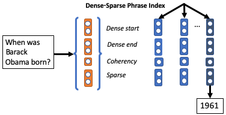

# Real-Time Open-Domain QA with Dense-Sparse Phrase Index



- [Paper](https://arxiv.org/abs/1906.05807), to appear at [ACL 2019](http://www.acl2019.org)
- [Live Demo][demo]
- BibTeX:
```
@inproceedings{denspi,
  title={Real-Time Open-Domain Question Answering with Dense-Sparse Phrase Index},
  author={Seo, Minjoon and Lee, Jinhyuk and Kwiatkowski, Tom and Parikh, Ankur P and Farhadi, Ali and Hajishirzi, Hannaneh},
  booktitle={ACL},
  year={2019}
}
```


## Demo
This section will let you host the demo that looks like


 
on your machine.
You can also try it out [here][demo].
You will need to download ~1.5 TB of files, but once you have them, it will take less than a minute to start serving.

### Prerequisites

#### A. Hardware
- CPUs: at least 4 cores recommended.
- RAM: at least 30GB needed.
- Storage: at least 1.5TB of SSD needed.
- GPUs: not needed.

If you are using Google Cloud 
(our demo is also being hosted on Google Cloud, with 8 vCPUs, 30 GB RAM, and 6 local SSDs),
we highly recommend using [local SSD](https://cloud.google.com/compute/docs/disks/local-ssd), 
which is not only cheaper but also offers lower disk access latency (at the cost of persistency).


#### B. Environment
We highly recommend Conda environment, since `faiss` cannot be installed with pip.
Note that we have two `requirements.txt` files: one in this directory, and one in `open` subfolder.
This directory's file is for hosting a (PyTorch-based) server that maps the input question to a vector.
`open`'s file is for hosting the search server and the demo itself.
In this tutorial, we will simply install both in the same environment.

1. Make sure you are using `python=3.6` through Conda. For instance, once you have Conda, create the environment via
```
conda create -n denspi python=3.6
```
then activate:
```
conda activate denspi
```

2. First, manually install `faiss` with `conda`:
```
conda install faiss-cpu=1.5.2 -c pytorch
```
3. Before installing with pip, make sure that you have installed `DrQA`. 
Visit [here](https://github.com/facebookresearch/DrQA) for instructions.
If you are using conda, you will probably need to install java-jdk in order to install DrQA:
```
conda install -c cyclus java-jdk
```
4. Then install both requirement files:
```
pip install -r requirements.txt
pip install -r open/requirements.txt
```
Note that this will give you an error if you don't have `faiss` and `DrQA` already installed.


#### C. Download
Model and dump files are currently provided through Google Cloud Storage under bucket `denspi`,
 so first make sure that you have installed `gsutil` ([link](https://cloud.google.com/storage/docs/gsutil_install)).
You will then need to download four directories.
0. Create `$ROOT_DIR` and cd to it:
```
mkdir $ROOT_DIR; cd $ROOT_DIR
```
1. You will need BERT-related files. 
```
gsutil cp -r gs://denspi/v1-0/bert .
```
2. You will need tfidf-related information from DrQA. 
```
gsutil cp -r gs://denspi/v1-0/wikipedia .
```
3. You will need training and eval data. Skip this if you will not be training the model yourself.
```
gsutil cp -r gs://denspi/v1-0/data .
```
4. You will need the model files. Skip this if you will train yourself (see "Train" below).
```
gsutil cp -r gs://denspi/v1-0/model .
``` 
5. You will need to download the entire phrase index dump. **Warning**: this will take up 1.5 TB!
```
gsutil cp -r gs://denspi/v1-0/dump .
```

You can also choose to download all at once via
```
gsutil cp -r gs://denspi/v1-0 $ROOT_DIR
```


### Run Demo

Serve API on port `$API_PORT`:
```
python run_piqa.py --do_serve --load_dir $ROOT_DIR/model --metadata_dir $ROOT_DIR/bert --do_load --parallel --port $API_PORT
```
This lets you to perform GET request on `$API_PORT` to obtain the embedding of the question in json (list) format.


Serve the demo on `$DEMO_PORT`:
```
cd open/
python run_demo.py $ROOT_DIR/dump $ROOT_DIR/wikipedia --api_port $API_PORT --port $DEMO_PORT
```

Demo will be served in ~1 minute.


## Train
Note that we provide pretrained model at Google Coud Storage `gs://denspi/v1-0/model` and you can simply download it.
This section will be only applicable if you want to train on your own.

Note that you will need 4 x P40 GPUs (24 GB) for the specified batch size.

1. Train on SQuAD v1.1: this will train the model on vanilla `train-v1.1.json` without negative examples
at `$SAVE1_DIR` of your choice. This will take approximately 16 hours (~5 hours per epoch, 3 epochs).
```
python run_piqa.py --train_batch_size 12 --do_train --freeze_word_emb --save_dir $SAVE1_DIR
```

2. Train with negative samples: this will finetune the model once more with negative examples sampled 
from other documents so that the model can better behave in open-domain environment.
This also takes approximately 16 hours with 3 epochs.
```
python run_piqa.py --train_batch_size  9 --do_embed_question --do_train_neg --freeze_word_emb --load_dir $SAVE1_DIR --iteration 3 --save_dir $SAVE2_DIR

``` 

3. Finally train a phrase classifier, 
which freezes every parameter except the linear layer at the end for classification.
This will be much faster, less than 4 hours.
```
python run_piqa.py --train_batch_size 12 --do_train_filter --num_train_epochs 1 --load_dir $SAVE2_DIR --iteration 3 --save_dir $SAVE3_DIR
```


## Create Phrase Index
For sanity check, we will first test with a small phrase index that corresponds to the entire dev data of SQuAD,
which contains approximately 300k words. Note that Wikipedia has 3 Billion words,
so this will be approximately 1/10k-th size experiment.

### Create Small (Dense-Only) Phrase Index

First, dump phrase vectors:
```
python run_piqa.py --do_embed_question --do_index --output_dir $ROOT_DIR/dump_small --load_dir $SAVE3_DIR --iteration 1 --filter_threshold -2 --parallel
```

Then create the phrase index and perform evaluation on the question embeddings:

```
cd open
python run_index_pred_eval.py $ROOT_DIR/dump_small $ROOT_DIR/data/dev-v1.1.jon --question_dump_path $ROOT_DIR/dump_small/question.hdf5
```
where 

You should obtain around 53 EM.


### Create Full Phrase Index
Here we want to extend the scale to full Wikipedia (3B tokens). 
Coming soon; for now, please download the dump from Google Cloud Storage (see "C. Download" above.)


## Questions?
Please use Github Issues.

## Acknowledgment
Our code makes a heavy use of [faiss](https://github.com/facebookresearch/faiss), 
[DrQA](https://github.com/facebookresearch/DrQA) and [BERT](https://github.com/google-research/bert), in particular,
Huggingface's [PyTorch implementation](https://github.com/huggingface/pytorch-pretrained-BERT).
We thank them for open-sourcing these projects!

[demo]: http://104.154.208.227:5900/
